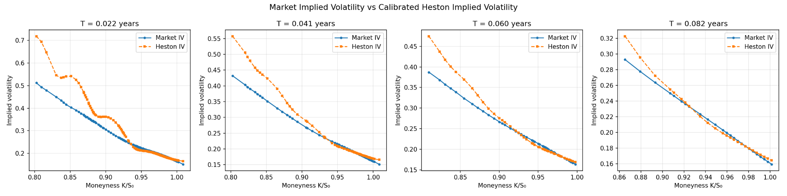
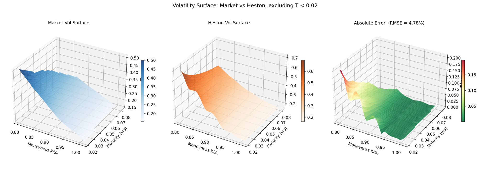

# Heston Model Calibration on S&P 500 Index Options

This academic project calibrates the Heston Stochastic Volatility Model to real S&P 500 index option data and compares the fitted Heston implied volatility surface against the market implied volatility surface.

The project was completed as part of my MSc coursework in Financial Data Science with Python.

## Project Overview

The objective of this project is to estimate the parameters of the Heston stochastic volatility model by minimising the difference between market implied volatilities and model-implied volatilities.

The implementation includes:

- Black-Scholes pricing functions
- Implied volatility inversion using numerical root-finding
- Heston characteristic function
- Semi-analytical option pricing through numerical integration
- Numerical validation tests
- Calibration using differential evolution
- Volatility smile comparison
- Market vs Heston volatility surface reconstruction

## Methodology

The model is calibrated on S&P 500 put options, as put options are particularly informative about downside risk and the equity-index volatility skew.

Very short maturities below 0.02 years are excluded from the calibration because ultra-short-dated options are often noisy and difficult for a standard constant-parameter Heston model to fit.

The calibration is performed on implied volatility rather than directly on option prices, as the main objective is to reproduce the volatility smile and volatility surface.

## Key Results

- Calibrated the Heston model to SPX put options.
- Excluded ultra-short maturities below 0.02 years due to market noise.
- Achieved an implied-volatility RMSE of approximately 4.78%.
- Reconstructed and compared market vs Heston volatility surfaces.
- The model captures the broad downward-sloping equity-index volatility skew, although errors remain larger for short-maturity, deep out-of-the-money puts.

## Outputs

### Volatility Smile Comparison



### Volatility Surface Comparison



## Full Report

A detailed academic report is available here:

[Download the full project report](report.pdf)

The report explains the theoretical background, the Heston model dynamics, the data cleaning process, the calibration methodology, the results, limitations and possible extensions.

## Repository Structure

```text
heston-spx-options-calibration/
│
├── README.md
├── heston.py
├── options_clean.csv
├── heston_params.json
├── requirements.txt
├── report.pdf
├── .gitignore
└── figures/
    ├── heston_smile_fit_excluding_short_maturity.png
    └── vol_surface_comparison_excluding_short_maturity.png
```

## How to Run

Install the required packages:

```bash
pip install -r requirements.txt
```

Run the main script:

```bash
python heston.py
```

The script performs validation checks, loads the option data, calibrates the Heston model and generates the volatility smile and volatility surface plots.

## Notes

The cleaned option dataset is included as `options_clean.csv`, so the project can be reproduced directly from the repository.

When the script is run, it saves newly generated plots as `heston_smile_fit.png` and `vol_surface_comparison.png`.

## AI Use Declaration

AI tools were used only to support grammar checking, error identification and structure refinement. The analysis, code and conclusions remain my own work.
